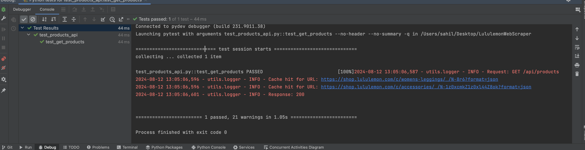

# Serverless FastAPI Application

## Overview
This is a serverless FastAPI application deployed on AWS Lambda using AWS API Gateway.

## Setup and Deployment
1. **Install Dependencies**:
   ```bash
   pip install -r requirements.txt
   ```

2. **Build and Deploy using AWS SAM**:
   ```bash
   sam build
   sam deploy --guided
   ```

## API Endpoints

### GET `/api/products`
Fetches product details from predefined Lululemon URLs.

#### Response
- **200 OK**: Returns a list of product details.

```json
[
  {
    "displayName": "Classic Unisex Ball Cap",
    "price": "38",
    "category": "Hats",
    "images": [
      "https://images.lululemon.com/is/image/lululemon/LU9BUMS_033123_1",
      "https://images.lululemon.com/is/image/lululemon/LU9BUMS_033123_2"
    ],
    "availableSizes": [
      "S/M",
      "L/XL"
    ],
    "colors": [
      "blue|https://images.lululemon.com/is/image/lululemon/blue_swatch?$swatch$",
      "white|https://images.lululemon.com/is/image/lululemon/white_swatch?$swatch$",
      "neutral|https://images.lululemon.com/is/image/lululemon/na_apr22_wk2_W_Neutrals_Neutral_CircleSwatch"
    ],
    "skuDetails": [
      "6|LU9BUMS-033123|33123|Oil Grey|us_153835547|S/M|blue",
      "5|LU9BUMS-027597|27597|Bone|us_150051044|S/M|whiteneutral"
    ],
    "productURL": "https://shop.lululemon.com/p/hats/Soft-Cap/_/prod11520436"
  }
]
```

### Testing Locally
To test locally before deploying, you can use SAM's built-in local capabilities:

```bash
sam local start-api
```

Make sure to run Local Redis, as its using redis as a cache

It can be installed from [here](https://redis.io/docs/latest/operate/oss_and_stack/install/install-redis/)

Start the server
```angular2html
redis-server 
```

### Accessing the API
Once deployed, you can access the API using the API Gateway URL provided by AWS SAM:

``https://your-api-id.execute-api.region.amazonaws.com/Prod/api/products``


## Notes
- This application is designed to run as a serverless service using AWS Lambda and API Gateway.
- Caching is implemented using `redis`.


API response


Unit Test  




